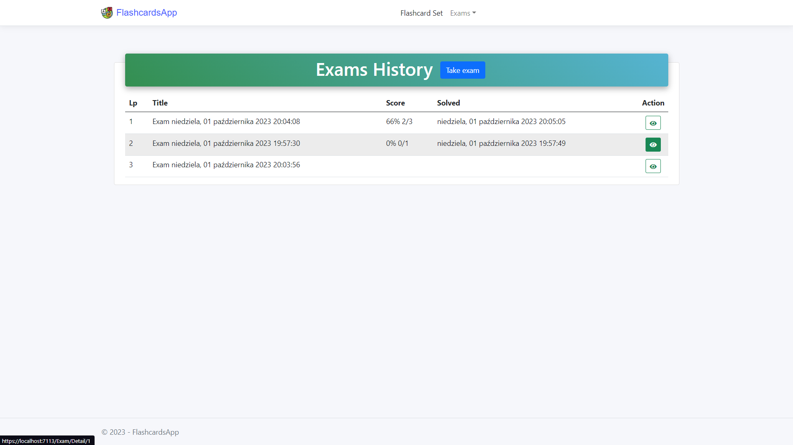

# FlashcardsApp

FlashcardsApp is a web application built using .NET 6 with the MVC architecture. It is a simple application designed to assist users in learning and managing flashcards. It allows you to create decks of flashcards, take exams to test your knowledge and track your learning progress. 

## Features

- **Flashcards Set Management**: Create, edit, and delete flashcard sets.
- **Flashcard Creation**: Easily create flashcards with terms and definitions.
- **Flashcard Studying**: Study flashcards through a user-friendly interface.
- **Exam Mode**: Take exams generated from flashcard sets.
- **History of exams**: Keep track of your performance and exam scores.


## Project Organization

```
├── FlashcardsApp.sln
├── README.md
│
├───Src
│   └───FlashcardsApp
│       │   appsettings.Development.json
│       │   appsettings.json
│       │   FlashcardsApp.csproj
│       │   FlashcardsApp.csproj.user
│       │   Program.cs
│       │
│       ├───Context
│       │   │   FlashcardAppDbContext.cs
│       │   │
│       │   └───Seeder
│       │           ExampleData.json
│       │           Seeder.cs
│       │
│       ├───Controllers
│       │       DeckController.cs
│       │       ExamController.cs
│       │       FlashcardController.cs
│       │
│       ├───Helpers
│       │       CloudinarySettings.cs
│       │
│       ├───Interfaces
│       │       IDeckRepository.cs
│       │       IExamRepository.cs
│       │       IFlashCardRepository.cs
│       │       IPhotoService.cs
│       │
│       ├───Models
│       │       Deck.cs
│       │       ErrorViewModel.cs
│       │       Exam.cs
│       │       Flashcard.cs
│       │       Question.cs
│       │
│       ├───Properties
│       │       launchSettings.json
│       │
│       ├───Repository
│       │       DeckRepository.cs
│       │       ExamRepository.cs
│       │       FlashcardRepository.cs
│       │
│       ├───Services
│       │       PhotoService.cs
│       │
│       ├───ViewModels
│       │   ├───Deck
│       │   │       CreateDeckViewModel.cs
│       │   │       EditDeckViewModel.cs
│       │   │
│       │   ├───Exam
│       │   │       CreateExamViewModel.cs
│       │   │       ExamViewModel.cs
│       │   │
│       │   └───Flashcard
│       │           FlashcardViewModel.cs
│       │
│       └───Views
│           │   _ViewImports.cshtml
│           │   _ViewStart.cshtml
│           │
│           ├───Deck
│           │       Detail.cshtml
│           │       Index.cshtml
│           │       _Create.cshtml
│           │       _Delete.cshtml
│           │       _Edit.cshtml
│           │
│           ├───Exam
│           │       Detail.cshtml
│           │       History.cshtml
│           │       Index.cshtml
│           │       _Create.cshtml
│           │
│           ├───Flashcard
│           │       _Create.cshtml
│           │       _Edit.cshtml
│           │
│           └───Shared
│                   Error.cshtml
│                   _Layout.cshtml
│                   _Layout.cshtml.css
│                   _ValidationScriptsPartial.cshtml
│       
└───Tests
    └───FlashcardsApp.Tests
        │   FlashcardsApp.Tests.csproj
        │   GlobalUsings.cs
        │
        └───Controllers
               DeckControllerTests.cs
               ExamControllerTests.cs
               FlashcardControllerTests.cs
        
```

## Prerequisites

Before you begin, ensure you have met the following requirements:

- [.NET 6.0 SDK](https://dotnet.microsoft.com/en-us/download/dotnet/6.0) installed on your machine.
- [Visual Studio](https://visualstudio.microsoft.com/pl/) or a code editor of your choice.
- [SQL Server](https://www.microsoft.com/en-us/sql-server/sql-server-downloads) for data storage (configured in the application).

## IMPORTANT

### 1. The Connection string
If you build my app, you should change connection string in  `appsettings.json`. Replace servername `Server=.\\SQLEXPRESS;` with `Server=(localdb)\\MSSQLLocalDB;`

### 2. Cloudinary Setup
Add Cloudinary Credentials in `appsettings.json` in the format:
```json
  "Cloudinary": {
    "CloudName": "",
    "ApiKey": "",
    "ApiSecret": ""
  }
```

## Getting Started

1. In the `/Src/FlashcardsApp` folder, run in terminal:
```
dotnet run seeddata
```
and the project should be running now on https://localhost:7113


## Folder Structure
The project follows a standard ASP.NET MVC structure. Here are some key folders and their purposes:

- **Controllers**: Contains controller classes responsible for handling HTTP requests.
- **Views**: Contains view templates rendered by the controllers.
- **Models**: Defines the data models used in the application.
- **ViewModels**: Defines view models used for data binding in views.
- **Repository**: Handles data access and database interactions.
- **Services**: Contains additional services used by the application.
- **wwwroot**: Contains static files like images and stylesheets.
- **Migrations**: Stores database migration files for Entity Framework.

## Built With:

- MVC Architecture
- ASP.NET Core
- Entity Framework
- SQL Server
- Razor Views
- Dependency Injection
- CloudinaryDotNet
- Bootstrap

## Screenshots

<details open>
<summary>Landing Page</summary>
<br>


</details>

---

<details>
<summary>Flashcards Set Detail Page</summary>
<br>


</details>

---

<details>
<summary>Flashcards Set Create Page</summary>
<br>


</details>

---

<details>
<summary>Flashcards Set Edit Page</summary>
<br>


</details>

---

<details>
<summary>Take exam</summary>
<br>


</details>

---


<details>
<summary>Results of exam</summary>
<br>


</details>

---

<details>
<summary>History of exams</summary>
<br>


</details>

---
